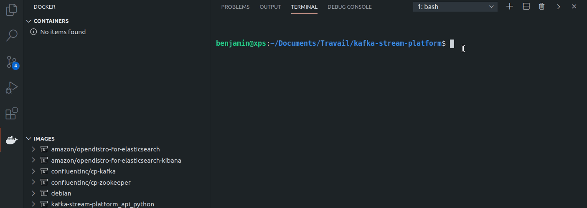

# kafka-stream-platform
This repository contains usecase of Kafka in Docker with other microservices



## :zap: Quickstart

Before using `docker` we must generate certificates used by differents nodes to authenticate.

```console
$ sudo apt-get install -y openjdk-14-jre-headless
$ bash generate-cert.sh
```

To start containers I'm using `docker-compose`, but feel free to use something else if you feel more confident :

```console
$ docker-compose up -d --build -V
```

### :warning: Between two restart

When restarting the cluster, kafka images might fail. This issue can be explained by the fact that kafka store a `cluster id` in his volumes.

To avoid this behavior, before using `docker-compose up -d` you would delete volumes and log by typing the following command :

```console
$ sudo rm -r vol/
```

Aside from this solution, we recommend to use the `-v` option when typing ([documentation](https://docs.docker.com/compose/reference/rm/)) :

```console
$ docker-compose down -v
```

it delete anonymous volumes along the down process.

### :information_source: How to interact with kafka's cluster

Once you've run `docker-compose up -d` you can start by interaction with the python API at `127.0.0.1:5000`